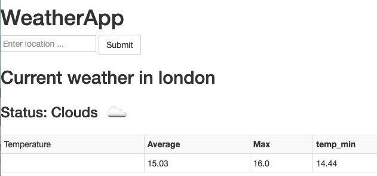

# Python3 Graduate Workshop - simple flask weather app

This directory contains all the code and documentation required for the python3 devops workshop.

## Requirements

* brew (MacOS package manager) `/bin/bash -c "$(curl -fsSL https://raw.githubusercontent.com/Homebrew/install/master/install.sh)"`
* pipenv `brew install pipenv` - if using a mac
* python3 `brew update && brew upgrade python` (Macs by default ship with python2, and this is now deprecated) NOTE: THIS MAY BE INCLUDED WITH MACOS CATALINA UNDER `/usr/bin/python3`
* openweathermap API key

## Pre-Requisite

We need to request the API keys from https://home.openweathermap.org/. Once an account is created we can create as many API keys as required. 
https://home.openweathermap.org/subscriptions gives details os the subscription. The Free plan allows 60 calls per minute per account.

## Description

This project is a simple Flask webapp written in python3 syntax, it will retrieve weather information for a given location and displays max/min/current temperature and a brief weather status along with a `.png` icon.
You must input a valid openweathermap API key in `config.yaml`, and specify a temperature unit for the application to run successfully.

Information is displayed on a dynamic html page within a table, this is read from a dictionary generated from `getCurrentWeather()`.

e.g:

`{'status': 'Clouds', 'icon_url': 'http://openweathermap.org/img/w/03d.png', 'temp': 15.03, 'temp_max': 16.0, 'temp_min': 14.44, 'temp_kf': None}`

This object can be queried using jinja syntax.

A shared client for openweathermap is created to avoid excessive instances being created, this is initialised using an API key read from `config.yaml` using the `yaml` package.

Simple exceptions are handled for the openweathermap API.

**Simple example of first interation:**

## Workshop Guide

The workshop guide will be a simple to follow step-by-step guide on how to write this webapp with python challenges along the way - we aren't going to be giving them all the answers.

Explanations will be given along the way along with detailed instructions on:

* Setting up VSCode IDE
* Installing brew package manager
* Installing python/pipenv via brew
* Inintialising the pipenv virtual environment with dependencies

**NOTE: API keys MUST be obtained prior to workshop and given to attendees as they take ~7hours to activate**

### Further implementations

Further methods can be implemented with the `weather_at_place.get_weather()` object, for example a further exercise could be to extract wind/rain/snow information.

Extra API calls can also be implemented and a placeholder example has been added for returning a 3-day forecast for a location (this would be handled in a similar way to the `getCurrentWeather()` function.)

Basic tests will be implemented.
