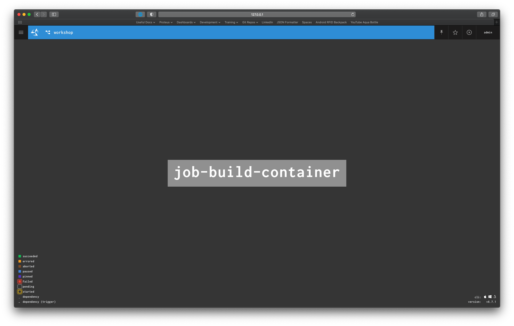

# 00 - Introduction

This will configure a Concourse instance locally which will allow you to automate building of the Docker image from the previous workshops, deploy that to a staging environment, run tests against that running instance before promoting to a production environment.

# 00 - Prerequisites

* Docker
    * [Docker for Mac Install](https://docs.docker.com/docker-for-mac/install/)
    * Docker Compose (this should also include `docker compose`)
* Fly CLI tool
    ```sh
    brew cask install fly
    ```
* Access to [Sky Github](https://github.com/sky-uk)
    * SSH Key Configured within Git
* A Dockerhub account 

**Suggested steps to avoid Dockerhub rate limit issues**
Either:
* Login to `docker` using your Dockerhub account using [`docker login`](https://docs.docker.com/engine/reference/commandline/login/)

or

* Configure [GCR as a local Docker mirror](https://cloud.google.com/container-registry/docs/pulling-cached-images#docker-ui)

> Signing into Dockerhub is the recommended approach for incoming graduates

# 01 - Containerising Your Application

## 1. Creating a container

You're now going to be running the flask app from the python workshop using a docker container. Create a Dockerfile in the root directory of your python application copying from the [template](01-containerising-the-application/Dockerfile)

* Modify the Dockerfile to build your flask app.  You should replace the `_` in the template.

Consider the steps that are taken by the `run.sh`.  We are trying to reproduce those in the Dockerfile.

* Try to build your flask app

`docker build –t flaskapp:v1 .`

Debug any problems with the build process (feel free to ask for help!). Once the image has been successfully built try running it. Don't forget to tell docker which port on your machine to forward to the container (hint: use the –p flag with `docker run`)

`docker run flaskapp:v1 ...`

Do you see output indicating that the flask server is running correctly? Head to a browser on http://localhost:5000 and try to use the web app.

Depending on your application config, there may be issues with the address that it listens on.  What does `localhost` inside a container mean?

## 2. Unit Testing during container build

When developing you should run tests every time a change is made to ensure that new features do not break the existing code. If your application build process includes containerisation, the tests can be run as part of the Dockerfile.

* Add a `RUN` step to your Dockerfile to ensure that the unit tests execute every time the image is built.
* Build the image again and tag it `flaskapp:v2`.
* Run the new image to see the output of the unit tests.

Congratulations!  You've now successfully built a container for the flask application.  Next we'll
look at concourse.

# 02 - Starting Your First Concourse Instance

## 1. Starting Concourse
* For this workshop we will be using a locally running instance of Concourse which can be started using `docker compose`
* Firstly, review the compose file to understand what is being created and set a password for your `admin` user. Keep this password safe, you will need it later
    > Make sure to never store passwords in config files as this is a security risk if your config is stored in version control
* Once the password has been set Concourse can be started with the following command
    ```sh
    docker compose up -d
    ```
    > If you want to see the output from the Concourse container omit the `-d` as this causes the container to run in the background
* You should now be able to access the UI via [`localhost:8080`](http://127.0.0.1:8080). If you don't see the following screen check that your docker containers are running
    

> In production systems secrets will be backed by a secret manager to prevent accidental exposure of secrets. Because we are running these Concourse instances locally we can afford to be a little more cavalier as secrets will not be exposed on a public endpoint.

## 2. Connecting via FLY
The Concourse UI is intended to be a view of the status of your pipelines, configuration is handled by the FLY CLI tool

* To connect to the Concourse instance using FLY you have to configure a `target`. This can be done with the command below. 
    ```sh
    fly --target workshop login --concourse-url http://127.0.0.1:8080 -u admin -p <USER_PASSWORD>
    ```
    > `USER_PASSWORD` is the password you set in the `docker compose` file above

    > A `target` is an alias to a configuration. This allows you use different targets to access multiple Concourse instances easily, or access multiple users on different teams that may have different permissions within the same instance. 
* It is important to make sure that FLY knows the Concourse version that is running so it can make the correct API calls. The `sync` command can be used for this
    ```sh
    fly --target workshop sync
    ```
* Targets are stored in the `~/.flyrc` file. You can check what information is stored by inspecting the file
    ```sh
    cat ~/.flyrc
    ```

## 3. Destroy Concourse
Congratulations, you've successfully started and connected to a local Concourse instance!

Whilst not necessary now as we will use this instance in the next section, when you're finished you can destroy the Concourse instance by running the following command from the directory that contains docker compose file
```sh
docker compose down
```

# 03 - Building and Pushing a Docker Container
The first step of any pipeline is the `build` phase. This is where the docker container is build and pushed to a container registry. Automating the process you went through earlier.

Concourse pipelines are all built using YAML, which means we can easily store that configuration in version control. More mature Concourse instances can be configured to generate these pipelines for you automatically. The skelton for these pipelines has been included with some steps omitted.

There is a Dockerfile included if you didn't manage to set one up in the previous task.  The
file here includes some improvements from the one we created before.  We've
used [multi-stage builds](https://docs.docker.com/develop/develop-images/dockerfile_best-practices/#use-multi-stage-builds) and tried to [minimize the number of layers](https://docs.docker.com/develop/develop-images/dockerfile_best-practices/#minimize-the-number-of-layers), as well as running as a non-root [user](https://docs.docker.com/develop/develop-images/dockerfile_best-practices/#user).  They are functionally the same.  Feel free
to use the one you created before or the one in the directory.

## 1. Generate the pipeline
* In [build-pipeline.yaml](03-building-docker-container/build-pipeline.yaml) there are two `TODO` lines. Using your docker knowledge we want to build and tag a docker image
    * Configure access to the Dockerhub Container Registry
        ```sh
        docker login -u <use the Dockerhub user environment variable> -p <user the Dockerhub password environment variable>
        ```
    * Build the Docker image
        * This is using the `docker build .` knowledge from the previous task
        * Make use of the `TAG` variable so you only need to update the tag once and this will pass through to other jobs in the pipeline
    * Push the Docker image to a container registry
        ```sh
        docker push ${TAG}
        ```

    > We will be using Dockerhub as our container registry which will be contactable from your `stage` and `prod` VMs. In a production system we would leverage GCR or ECR (GCP and AWS container services)

## 2. Configure the pipeline in Concourse
As discussed above we configure the pipelines using the FLY CLI tool. All FLY commands work on the same principle. You specify a target, an action, and then any specific flags such as pipeline name, configuration files and variables.

* To configure the pipeline we need the `set-pipeline` command. Once this runs you will have to confirm that you are happy with the YAML that's being uploaded
    ```sh
    fly --target workshop set-pipeline \
        --pipeline workshop \
        --config build-pipeline.yaml \
        --var "ssh-key=$(cat ~/.ssh/id_rsa)" \
        --var "dockerhub-user=<dockerhub username>" \
        --var "dockerhub-password=<dockerhub password>"
    ```
    > New pipelines start paused, this is to prevent anything triggering prematurely, you can either unpause using the CLI or via the UI

    > The `ssh-key` need to be the key you have configured for use with Github & `dockerhub-user` and `dockerhub-password` need replacing with your Dockerhub credentials

    > Again, remember that passwords and other secrets should never be stored in plaintext and should be read dynamically from a secret management solution such as Hashicorp Vault
* Your new pipeline should appear in the UI as below
    
    > You can unpause using the "play" button on the pipeline box
* By selecting the pipeline you can see the jobs that have been configured
    
    > Pipelines can also be unpaused here in the top right
* You can select a job to see the previous build history
    

## 3. Running the pipeline
Pipelines can be run a number of ways. You can trigger when code changes are pushed to `master` in Git, when a timer has elapsed, or the way we're going to trigger, manually.

* One the pipeline has been unpaused we can either trigger using the `+` in the top right in the job view, or via the CLI using the following command
    ```sh
    fly --target workshop trigger-job --job workshop/job-build-container
    ```
* You can view the output of the running task in the `job` view in the UI, or by appending the `-w` flag to the above command to watch in terminal
    

* You can confirm that your image has been successfully pushed by checking Dockerhub
    

# 04 - Deploying the Docker Container - Stage
Once the image has been build and pushed to a container registry we can deploy it onto a VM. In a production system deployment would be handled by a specific tool, but in this case we are simply going to SSH into a VM and start the docker container running

* The next file we will be working with is [stage-deploy-pipeline.yaml](04-deploying-to-stage/stage-deploy-pipeline.yaml)
* Firstly, the pipeline needs updating to include the build job from [section 3](#03---building-and-pushing-a-docker-container)
* Next there is another `TODO` in the body of the task, this time we want to SSH into the provided `stage` VM and start the previously built docker container running
    ```sh
    sshpass -p ${SSH_PASSWORD} ssh -o StrictHostKeyChecking=no grads@${VM_PUBLIC_IP} << EOF
    docker login -u ${DOCKERHUB_USER} -p ${DOCKERHUB_PASSWORD}
    # Stop and remove all running containers
    set -eux
    docker stop python-webapp || echo "No containers running"
    docker rm python-webapp || echo "No containers running"
    docker run --name=python-webapp -d -p 80:5000 $TAG
    EOF
    ```

* The pipeline can be deployed as above using
    ```sh
    fly --target workshop set-pipeline --pipeline workshop \
        --config stage-deploy-pipeline.yaml \
        --var "ssh-key=$(cat ~/.ssh/id_rsa)" \
        --var "dockerhub-user=<dockerhub username>" \
        --var "dockerhub-password=<dockerhub password>" \
        --var "vm-stage-public-ip=<stage_vm_ip>" \
        --var "ssh-stage-password=<stage_vm_password>"
    ```
    > Is this all of the variables that are required? Could a variables file be used?

    > If this pipeline runs multiple times how will the Concourse job handle starting multiple Docker containers?

* Once the pipeline has run successfully you should be able to SSH into your stage VM from terminal and view the deployed app!

# 05 - Deploying the Docker Container - Prod
This is the same idea as the above except we would want to make sure thorough testing has been performed on the `stage` deployment before deploying to `prod`. If any of those test fail we want the pipeline to halt to allow us time to fix the issues.

The simplest test that can be performed is the same as you did manually, is the app up and running? 
> Note that in a production system this is not a sufficient test but is acceptable for now

* Same as above we will now be working with [prod-deploy-pipeline.yaml](05-deploying-to-prod/prod-deploy-pipeline.yaml) and need to include all of the previous job tasks
* Also the same as above there are another two `TODO` items here. The first is to write a suitable test to determine whether the stage 
    * Write the test to determine that the pod is healthy
        ```sh
        # Install curl for testing
        apk add curl

        while true
        do
        STATUS=$(curl -s -o /dev/null -w '%{http_code}' ${VM_PUBLIC_IP})
        if [ $STATUS -eq 200 ]; then
            echo "Got 200! All done!"
            break
        else
            echo "Got $STATUS :( Not done yet..."
        fi
        sleep 10
        done
        ```
    * SSH into the VM to deploy to prod should be the same as deploying to stage
    
* You can use the `--load-vars-from` flag when defining a pipeline to load your vars from a file
    ```sh
    fly --target workshop set-pipeline --pipeline workshop \
        --config prod-deploy-pipeline.yaml \
        --load-vars-from vars.yaml \
        --var "ssh-key=$(cat ~/.ssh/id_rsa)" \
        --var "dockerhub-password=<dockerhub password>"
    ```
<!-- TODO: Add more tips and guidance -->

* Now that our `stage` and `prod` deployments are working we can make a change to the Dockerfile that will cause the webapp to break. Obviously we would normally avoid adding code the deliberately breaks a deployment but this is a workshop.
    > This can be something as simple as preventing the webapp from starting up
* Once that change has been made we can trigger the pipeline again and providing your tests are sufficient should deploy to `stage`, fail those tests and halt the pipeline, leaving the `prod` deployment still serving

---

# Extension - Setting Triggers
In Concourse it is possible to trigger builds when new commits are pushed to a branch. Resources surrounding this topic can be found [here](https://concoursetutorial.com/basics/triggers/). This will need to be done off your own branch as you won't be able to push to `master`.

If you get this far please speak to the engineers for more information.

# Extension - NFT Testing
In an attempt to replicate a real world service that has been deployed we would like you to add some latency into the Python webapp. Once this has been added we can use a tool such as `httpperf` to check for that latency and cause that to fail the test.

If you get this far please speak to the engineers for more information.
